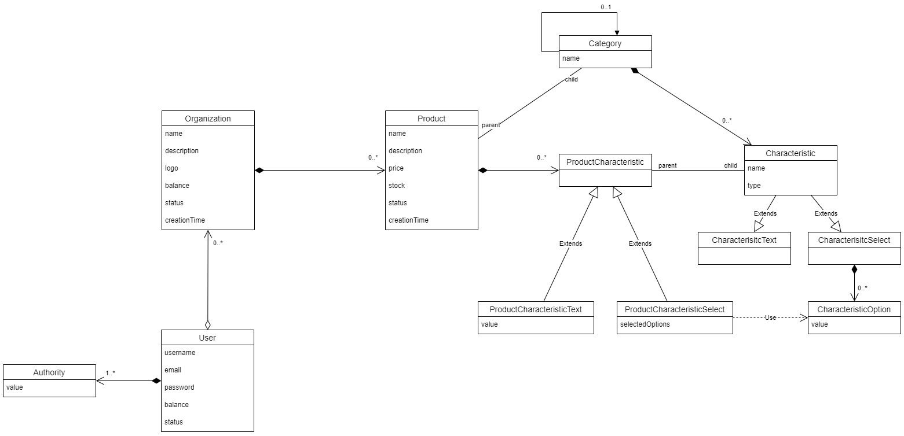

Run Swagger Editor
```
docker compose -f .\docker-compose-swagger.yml up -d
```

View the database in Docker container
```
docker exec -it postgres bash

psql -U postgres

\dt

\d users
\d+ users
```